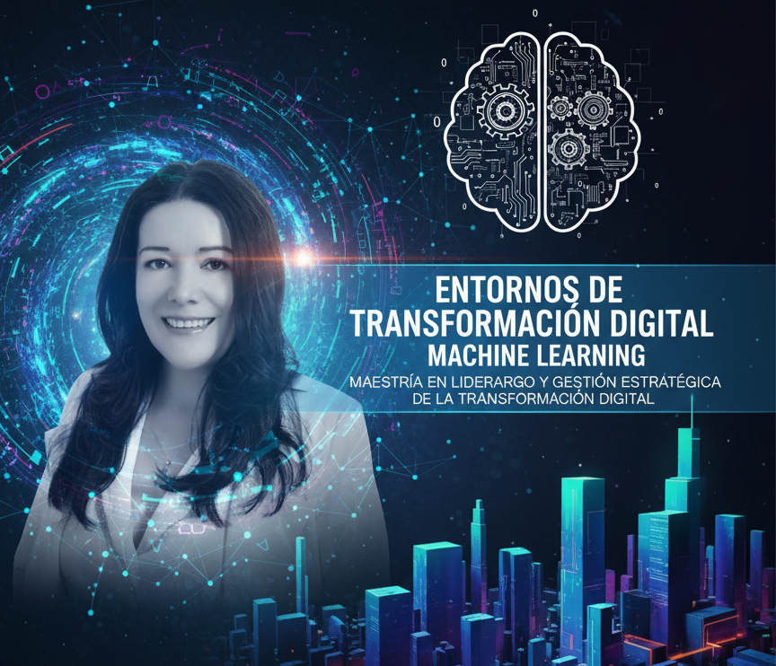

# 📘 td_machine_learning
Entornos de Transformación Digital - Machine Learning

  

  <b>Repositorio del espacio académico</b> 
  Talleres • Ejercicios • Recursos • Código fuente

## ✨ Descripción

Este repositorio contiene el material complementario del espacio académico **Entornos de Transformación Digital - Machine Learning**

Aquí encontrarás:

- 📚 Talleres prácticos
- 💻 Ejercicios de programación
- 📓 Notebooks interactivos
- 📂 Datasets
- ✅ Soluciones
- 🔗 Recursos adicionales

---

# 🗂️ Tabla de Contenido
1. Instalar el ambiente de trabajo Python + Antigravity: Demo: 
